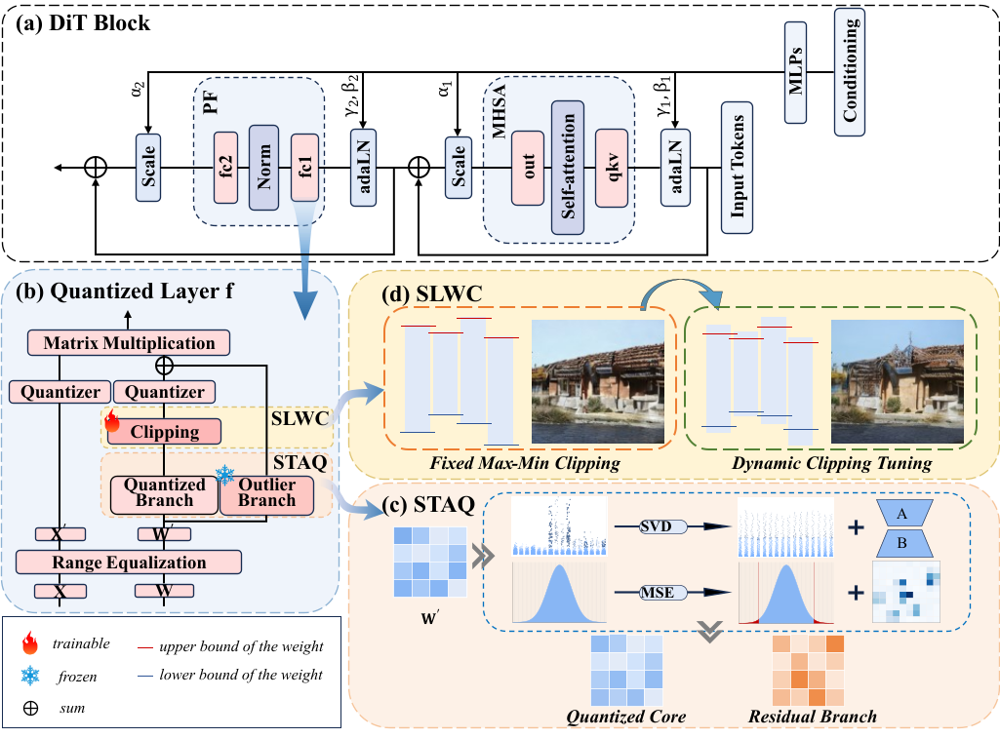
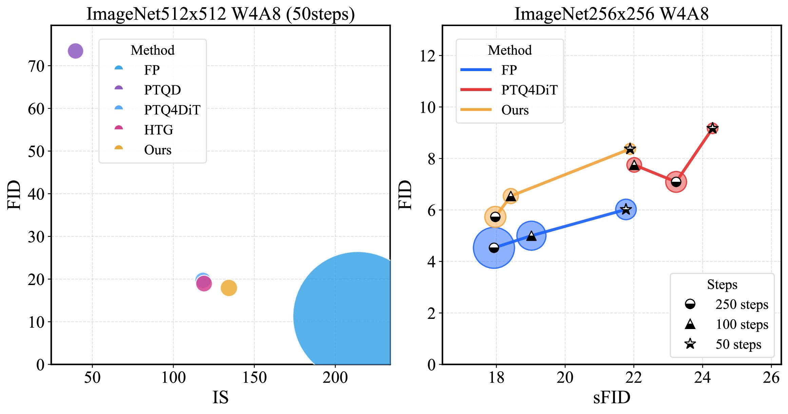
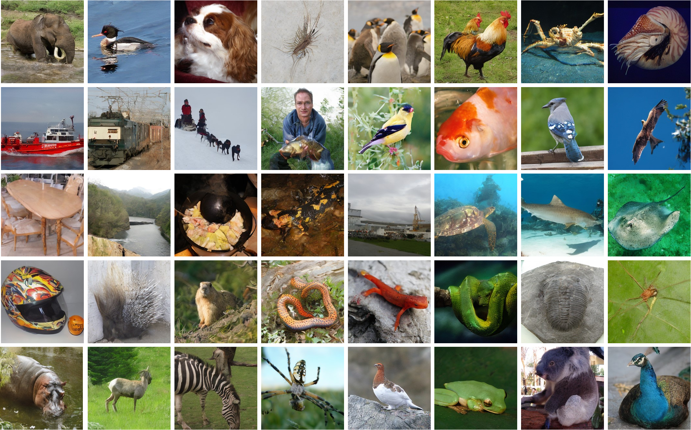

# Structure and Tail Aware Quantization for High Fidelity Diffusion Transformers

## Method



Overview of our method. Stage 1: Originally, DiT activations exhibit severe timestep-dependent outliers, complicating low-bit inference. We first apply Activation-Weight Range Rebalancing to migrate the dynamic range burden from activations to weights. This stabilizes activation distributions but results in heavier-tailed weights that are harder to quantize. Stage 2: To address these challenging weights, we introduce Spectral-Tail Adaptive Quantization (STAQ). This decomposes the smoothed weights into a quantized core and a high-precision outlier branch, ensuring that structurally critical values are preserved. Stage 3: Finally, we employ Schedule-Aware Learnable Weight Clipping (SLWC). This optimizes channel-wise clipping thresholds by calibrating across the full diffusion schedule, dynamically aligning quantization ranges to minimize error propagation throughout the denoising process.

## Performance




Under W4A8 settings, our method significantly outperforms baseline methods, closely matching the quality of full-precision models while substantially reducing computational costs. This enables practical, high-quality image synthesis.



Our W4A8-quantized model delivers class-consistent samples on ImageNet ( 256×256 ). It successfully preserves both global structure and fine high-frequency details, verifying its ability to maintain high perceptual fidelity under efficient low-bit settings.

## Usage

### Environment Setup
```bash
conda env create -f environment.yml
conda activate STQ-DiT
```


### Calibration Data
Use the following command to generate calibration datasets.
```bash
mkdir calib

torchrun --nproc_per_node=1 get_calibration_set.py --model DiT-XL/2 --image-size 256 \
--ckpt pretrained_models/DiT-XL-2-256x256.pt \
--num-sampling-steps 50 \
--outdir calib/ --filename DiT-256_sample4000_50steps.pt \
--cfg-scale 1.5 --seed 1
```
For other settings, please change `--image-size` and `--num-sampling-steps`.

### Quantization
- Example of quantizing DiT-XL/2 with 50 timesteps into W8A8 on ImageNet 256x256 generation.
```bash
torchrun --nproc_per_node=1 quant_sample.py --model DiT-XL/2 --image_size 256 \ 
--ckpt pretrained_models/DiT-XL-2-256x256.pt \ 
--num_sampling_steps 50 \
--weight_bit 8 --act_bit 8 --cali_st 25 --cali_n 64 \ 
--cali_batch_size 32 --sm_abit 8 --cfg_scale 1.5 \
--cali_ckpt output/256_48_50_calib/ckpt.pth \ 
--seed 1 --ptq --recon
```
To specify other bit-widths, please change `--weight_bit` and `--act_bit`.
For different numbers of timesteps, please change `--num-sampling-steps` and use the corresponding calibration data by changing `--cali_data_path`.

- Example of quantizing DiT-XL/2 with 50 timesteps into W4A8 on ImageNet 512x512 generation.
```bash
torchrun --nproc_per_node=1 quant_sample.py --model DiT-XL/2 --image_size 512 \ 
--ckpt pretrained_models/DiT-XL-2-512x512.pt \ 
--num_sampling_steps 50 \
--weight_bit 4 --act_bit 8 --cali_st 25 --cali_n 64 \ 
--cali_batch_size 32 --sm_abit 8 --cfg_scale 1.5 \
--cali_ckpt output/512_48_50_calib/ckpt.pth \ 
--seed 1 --ptq --recon
```


### Inference
- Example of DiT-XL/2 with 50 timesteps and W8A8 for ImageNet 256x256 generation.
```bash
torchrun --nproc_per_node=1 quant_sample.py --model DiT-XL/2 --image-size 256 \
--ckpt pretrained_models/DiT-XL-2-256x256.pt \
--num-sampling-steps 50 \
--weight_bit 8 --act_bit 8 --cali_st 25 --cali_n 64 --cali_batch_size 32 --sm_abit 8 \
--outdir output/ \
--cfg-scale 1.5 --seed 1 \
--resume --cali_ckpt output/256_88_50/ckpt.pth \
--ptq \
--inference --n_c 10
```


### Evaluation
We use the [ADM’s TensorFlow evaluation suite](https://github.com/openai/guided-diffusion/tree/main/evaluations) to calculate FID, sFID, IS, and Precision.
